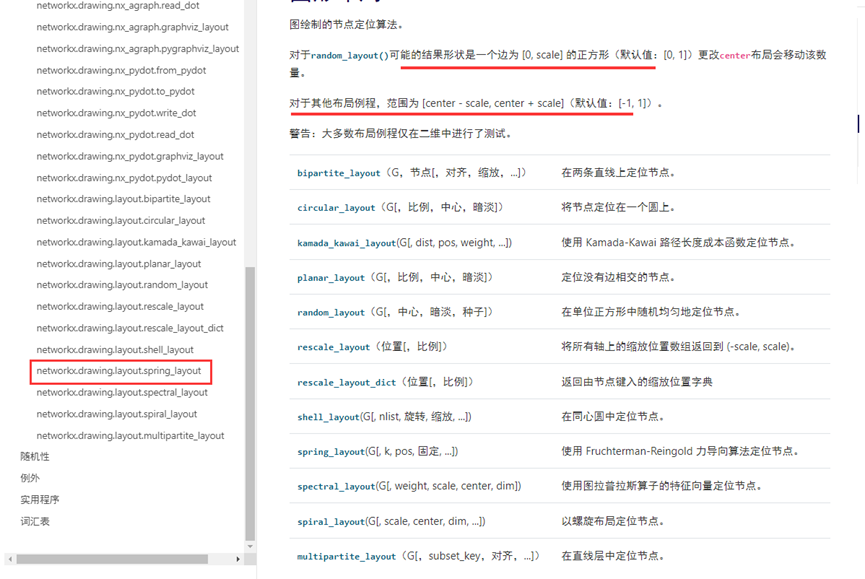

# 一、	字符云图
参考资料：
http://amueller.github.io/word_cloud/
`wordcloud = WordCloud().generate(text)`
`wc.generate_from_frequencies(frequencies= frequencies)`
可能遇到的问题总结：
1、	显示汉字字符云图时乱码，解决办法：加如下属性：
`#设置字体，不指定就会出现乱码`
`font_path=r'wqy-microhei.ttc',`
2、设置的既定词未显示全，解决办法：
设置更大的画布，足够装下这些词，或者有空余的地方时，可以接受词语竖着显示，让词语间隔更小，节省空间。
使用mask的就把mask的设置画布图给规划大点的。
使用长宽自定义的，就尽量设置大的长宽，并可以把字体最大和最小值设置调的更小。
`#所有字体都横向显示，0.9值，表示9成横向显示，一成竖着显示。1表示全部横向`
`prefer_horizontal=1,`
3、根据词频显示时，注意frequencies属性为字典类型。键值对：词：词频数。
我遇到的问题是用WordCloud().generate(text)方法也能在本地按词频显示大小，出现重复词越多，这个词字体越大。但是放在线上运行的时候，这个就不行（不知道为什么本地环境和线上表现不一样）。结果果断改用对应的词频API。

# 二、关系图
参考资料：
https://networkx.org/documentation/latest/reference/classes/index.html
https://www.osgeo.cn/networkx/tutorial.html
https://matplotlib.org/
可能遇到的问题：
1、有向图和无向图不能乱用，无向图虽然也可以加箭头，但是无法控制箭头指向的方向。箭头是自动加的。
有向图才可以从suorce节点到target节点指向，箭头指向suorce节点。
2、学会合理利用现有给定的节点布局样式，例如：

layout_spring_layout是一个以中心节点向外均匀散射出的关系图。
3、存在中文乱码情况解决办法一：
https://www.biaodianfu.com/matplotlib-chinese.html
（1）. 使用print(matplotlib.matplotlib_fname())打印此文件位置
（2）. 打开此文件，如：D:\Python\Python39\lib\site-packages\matplotlib\mpl-data\matplotlibrc，编辑
（3）. 找到 font.serif 和 font.sans-serif 移除注释，加入 `WenQuanYi Micro Hei`, 
（4）. 删除缓存 C:\Users\huxiaobing\.matplotlib 
解决办法二：
`plt.rcParams['font.sans-serif'] = ['simhei']  # 用来正常显示中文标签`
4、自定义节点位置：
`pos = {“节点名1”: array([0.0, 0.0]), “节点名2”: array([0.1, 0.1]), }`
`nx.draw(G, pos, node_color=colors, edge_color=linecolor, width=1, edge_cmap=plt.cm.Blues, node_size=sizes,
        with_labels=True, arrows=arrows, font_size=9 )`
pos是复杂的字典类型，按如上格式配置pos值即可。

总体总结：
1、以上功能需要运行在Microsoft Visual C++ 的基础上，所以需要引入Microsoft Visual C++ 14.0及以上版本安装。
2、修改完grpc的proto文件，需要重构编译为python文件，需要执行如下命令：
`python -m grpc_tools.protoc -I src/proto --grpc_python_out=src/python src/proto/WordImage.proto`
3、安装networkx时，建议用`pip install networkx[default]`，安装networkxwith的当前版本。
要升级到较新版本，请使用以下`--upgrade`标志

